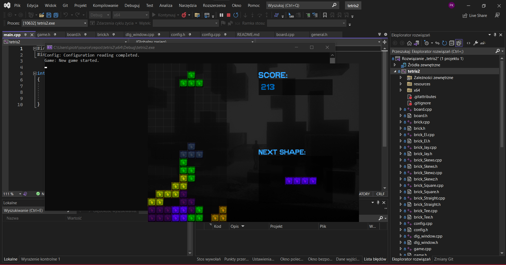

# Tetris in C++ using SFML

## Project Description
This project is an implementation of the classic Tetris game in C++ using the Simple and Fast Multimedia Library (SFML). The game allows the player to stack blocks to form complete lines and earn points. The project's goal is not only to create a functional game but also to learn object-oriented programming and integration with a graphics library.

## Requirements
1. C++ compiler (e.g., g++)
2. SFML library - [SFML Installation Instructions](https://www.sfml-dev.org/tutorials/2.5/start-linux.php)

## Running the Game
1. In order to run game without compiling it again, download the project folder from github
2. Run the .exe file. 

### Controls

- **Left arrow:** Move the block left
- **Right arrow:** Move the block right
- **Down arrow:** Rotate block left
- **Up arrow:** Rotate the block right 
- **Space:** Drop the block to the bottom
- **Esc:** Open pause menu

### Project Features

- Fully functional startscreen 
- Array of options to chose from to adjust the game to your liking
- Leaderboard of top 5 scores 
- Tetris blocks in different shapes
- Scoring for completing full lines
- System of levels with increasing difficulty 
- Display of the current score
- Collision handling for blocks
- Rendering the game board and graphic design using SFML

## Authors
- Piotr Kobusiński
- Hubert Błaszczyk  

## Sample Screenshot

## Notes
This project is created for educational purposes and may require some modifications to work correctly in your environment. If you encounter any issues, please let me know.

Thank you for your interest in our project! Enjoy playing Tetris.